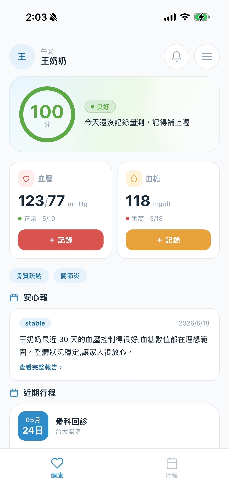
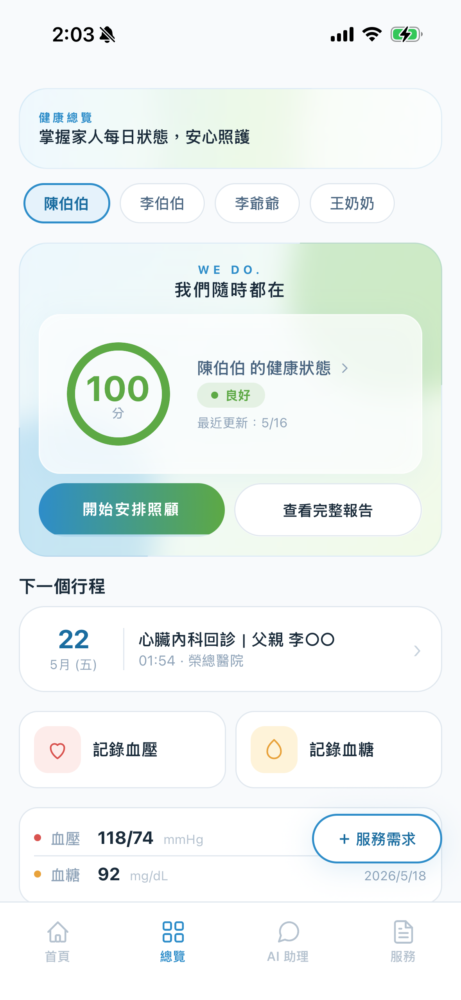
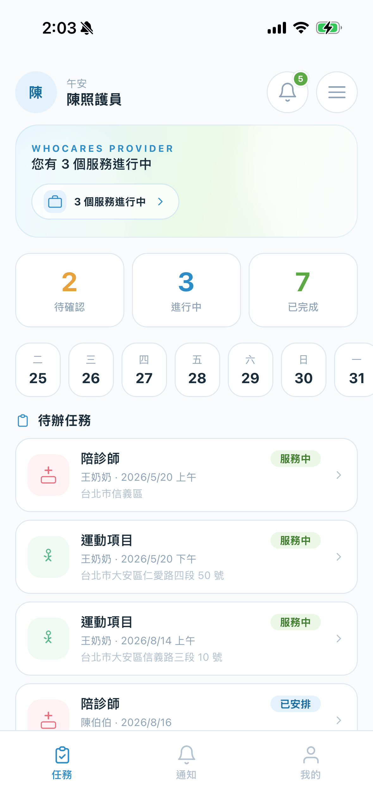
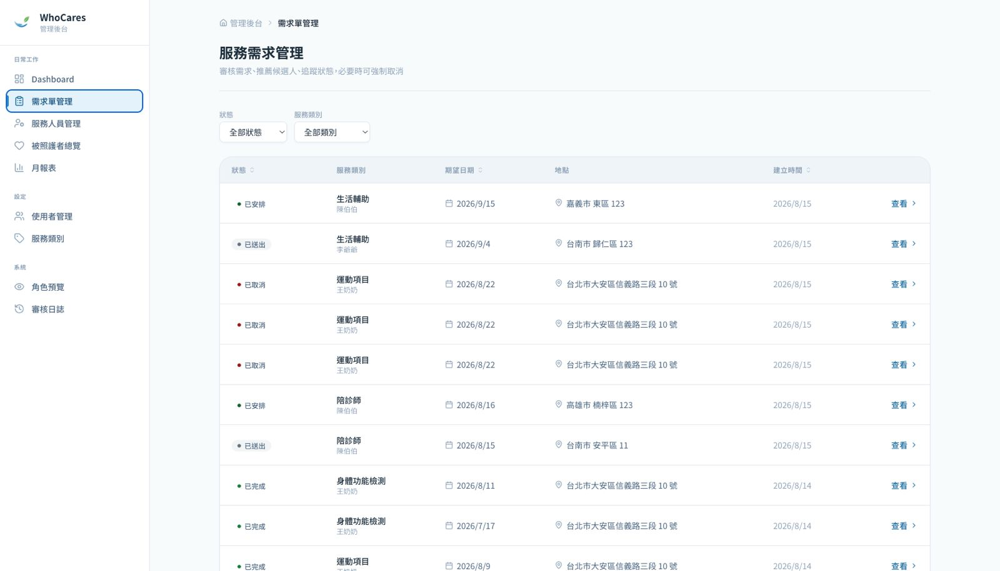
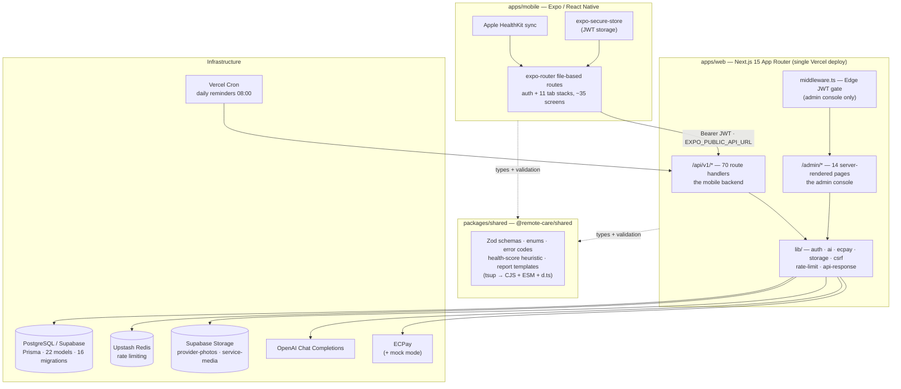
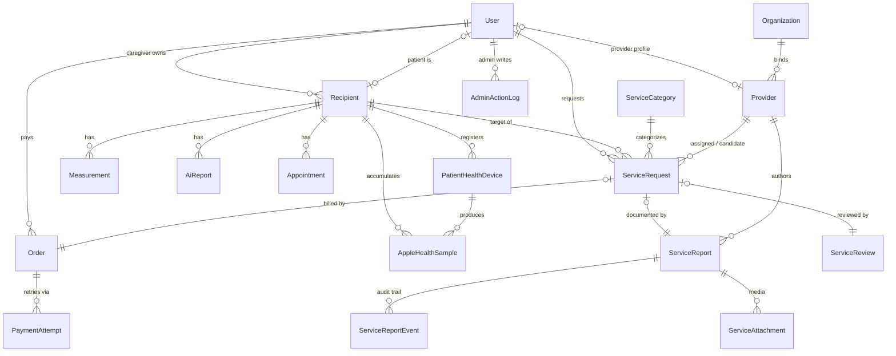
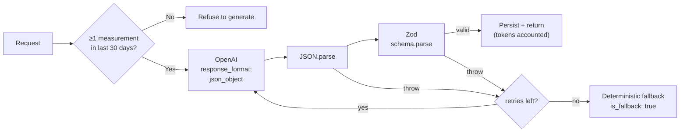

# WhoCares — Remote Elder-Care Platform

> A production-shaped, multi-role care platform: family caregivers track an elder's health, book vetted care providers, and receive AI-generated summaries. Mobile app (Expo) + web API and admin console (Next.js) + Postgres, built as a pnpm/Turborepo monorepo.
>
> **~48k lines of first-party TypeScript · 70 API handlers · 22 database models · 167 commits over 5.5 months.**

This repository is private. This README documents the architecture, the design decisions behind it, and — in the last section — where it would break under real load.

---

## Contents

- [What it does](#what-it-does)
- [Screenshots](#screenshots)
- [Architecture](#architecture)
- [Data model](#data-model)
- [Authorization: four roles, one user table](#authorization-four-roles-one-user-table)
- [AI integration: not trusting the model](#ai-integration-not-trusting-the-model)
- [Engineering decisions and their costs](#engineering-decisions-and-their-costs)
- [How this was built](#how-this-was-built)
- [What I'd fix before this took real traffic](#what-id-fix-before-this-took-real-traffic)

---

## What it does

Four kinds of people use the same system, and each sees a different slice of it:

| Role | What they do |
|---|---|
| **Caregiver** (family member) | Registers an elder as a *recipient*, logs blood pressure / glucose, syncs Apple Health data, books services, pays, reads AI health summaries |
| **Patient** (the elder, optionally with their own device) | Self-scoped view of their own readings, schedule, and reminders |
| **Provider** (vetted care worker) | Accepts assigned jobs, runs an in-progress flow, files a template-driven one-tap service report with photo/audio evidence |
| **Admin** | Vets providers, suspends users, manages service categories, reviews an append-only audit log, and can preview the app as any role |

The product is deliberately **non-clinical**. Prompts and copy are constrained away from diagnosis, medication advice, and health-outcome guarantees — that constraint is enforced in the system prompt and validated in the output schema, not just written in the design doc.

---

## Screenshots

<table>
<tr>
<td width="33%" align="center">
<br>
<b>Patient — health home</b><br>
<sub>Readings with abnormality flags, chronic-condition tags, an AI-generated family-readable summary, and upcoming appointments.</sub>
</td>
<td width="33%" align="center">
<br>
<b>Caregiver — multi-recipient overview</b><br>
<sub>Switches between elders in one family. Computed health score, next appointment, quick-log actions, direct path to request a service.</sub>
</td>
<td width="33%" align="center">
<br>
<b>Provider — assigned tasks</b><br>
<sub>Task-scoped, not recipient-scoped: a provider sees only what an assigned service request exposes.</sub>
</td>
</tr>
</table>

**Admin — service request console**

Cross-tenant operations. Every privileged mutation writes an `AdminActionLog` row; the console also has a role-preview mode for verifying permission boundaries from the inside.



---

## Architecture

A pnpm workspace with Turborepo. Two apps, one shared contract package.



**The shared package is the load-bearing piece.** `@remote-care/shared` compiles once and is consumed by both the mobile client and the server as `workspace:*`. Request/response shapes, enum values, error codes, the `calculateHealthScore` heuristic, functional-norm thresholds, and report templates all live there — so the client and server physically cannot disagree about them. Root `postinstall` builds it before anything else, and an `eas-build-pre-install` hook does the same in the mobile release pipeline.

**Stack:** Expo 54 / RN 0.81 / React 19 · Next.js 15 · Prisma 6 / PostgreSQL · Zod 3 · JWT (`jsonwebtoken` on Node routes, `jose` at the Edge) · Upstash Redis · OpenAI `gpt-4o-mini` · Sentry on both apps · Vercel (`hnd1`, co-located with the database region) · EAS Build.

---

## Data model

22 Prisma models. UUID primary keys, `timestamptz` throughout, soft delete via `deleted_at` on several tables, snake_case table names via `@@map`.



Two modelling choices worth calling out:

**The four roles are not four tables.** `User.role` is a single discriminator column; role-specific data hangs off relations (a provider has a `Provider` profile row, a caregiver owns `Recipient[]`, an admin has no extra table at all). This keeps authentication uniform — one login path, one token shape — at the cost of pushing all role logic into the application layer.

**`Recipient` is decoupled from `User`.** The cared-for elder is a first-class entity owned by a caregiver, and *optionally* linked to a `User` when they have their own device and login. This is the modelling detail that makes the product work: most elders never log in, but the system still needs a stable subject for measurements, appointments, and reports.

---

## Authorization: four roles, one user table

Authorization is enforced in three layers. There is deliberately **no Postgres RLS** — see the trade-off note below.

**1. Edge middleware — coarse gate, admin console only.**

```ts
// apps/web/middleware.ts
if (pathname.startsWith('/admin') && pathname !== '/admin/login') {
  const token = request.cookies.get('auth_token')?.value;
  if (!token) return NextResponse.redirect(new URL('/admin/login', request.url));
  const { payload } = await jwtVerify(token, secretKey, { algorithms: ['HS256'] });
  if (payload.role !== 'admin') return NextResponse.redirect(new URL('/admin/login', request.url));
}
export const config = { matcher: ['/admin/:path*'] };
```

This does **not** cover `/api/*`. The API authenticates per handler, so that a missing middleware matcher can never silently open an endpoint.

**2. Per-request authentication — `verifyAuth`.**

Accepts a `Bearer` header (mobile) or the `auth_token` httpOnly cookie (admin web), verifies the HS256 JWT, then does exactly **one** database read to confirm the user exists and `suspended_at IS NULL`.

The trade-off is explicit and documented in the file: **role comes from the token**, so a role change takes effect on next login (≤7-day TTL), but **suspension is immediate**, because the DB is checked on every request. Reading the role from the DB every request was rejected to keep the hot path to one query; a pure stateless JWT was rejected because you then cannot revoke a compromised account.

**3. Per-resource ownership — `ensureRecipientAccess`.**

```ts
// apps/web/lib/recipient-access.ts
switch (auth.role) {
  case 'caregiver':
    if (!policy.caregiver) return { ok: false, code: 'AUTH_FORBIDDEN' };
    if (recipient.caregiver_id !== auth.userId) return { ok: false, code: 'RESOURCE_OWNERSHIP_DENIED' };
    return { ok: true, recipient };
  case 'patient':
    if (!policy.patient) return { ok: false, code: 'AUTH_FORBIDDEN' };
    if (recipient.patient_user_id !== auth.userId) return { ok: false, code: 'RESOURCE_OWNERSHIP_DENIED' };
    return { ok: true, recipient };
  case 'provider':
    if (!policy.provider) return { ok: false, code: 'AUTH_FORBIDDEN' };
    // Provider access is gated upstream by service-request assignment;
    // this helper gates by role only. Caller MUST assert the task exists.
    return { ok: true, recipient };
  case 'admin':
    if (!policy.admin) return { ok: false, code: 'AUTH_FORBIDDEN' };
    return { ok: true, recipient };
}
```

Sensitive POST routes additionally run a `checkOrigin` CSRF check.

### Visibility matrix

| | Caregiver | Patient | Provider | Admin |
|---|---|---|---|---|
| Recipients | Own only | Self only | **Via assigned task only** | All |
| Measurements | Read/write | Own | Visit-relevant subset | Read |
| Longitudinal health series | Yes | Own | **Denied** | Read |
| AI health reports | **Generate + read** | — | **Denied** | Read |
| Service requests | Create, confirm, cancel | — | Accept, progress, report | Force status change |
| Payments | Own orders | — | — | Read |
| User suspension / provider vetting | — | — | — | Yes, **always audit-logged** |

The provider row is the interesting one. A provider is **task-scoped, not recipient-scoped**: they never get the longitudinal series or the AI reports, only what a specific assigned service request exposes. For a care platform that boundary is the whole ballgame — a care worker should see today's visit context, not a person's medical history.

---

## AI integration: not trusting the model

`gpt-4o-mini` via Chat Completions, `temperature: 0.3`, `max_tokens: 500`. Report types: `health_summary`, `trend_analysis`, `visit_prep`, `family_update`. A separate path turns a provider's structured report answers into a family-readable summary.

The interesting part isn't the API call — it's everything wrapped around it.



**Four layers, each catching a different failure:**

1. **JSON mode** (`response_format: { type: 'json_object' }`) guarantees syntactic validity — and nothing else.
2. **`JSON.parse`** catches truncation.
3. **Zod validation** against a per-task schema from the shared package. This is the layer that actually enforces meaning: JSON mode will happily return well-formed JSON with the wrong fields.
4. **Bounded retry → deterministic fallback.** On final failure the caller receives a hard-coded, schema-valid object flagged `is_fallback: true`. The app degrades to canned text; it never 500s on a bad completion.

**And one guard that sits before all of them.** `ai/health-report` refuses to generate at all when the recipient has no measurements in the last 30 days. This wasn't a design decision up front — it came from watching the model confidently produce an `attention` status from an empty input, which then propagated into the home-screen health score. The lesson generalises: schema validation tells you the *shape* is right, not that the model had anything to reason from. Empty input is a data-layer problem, and it has to be caught there.

Token counts are persisted per report and per interaction. Raw prompts and responses are stored only when `AI_DEBUG_LOGGING` is on and never in production. Generation is rate-limited per caregiver and per recipient via Upstash.

---

## Engineering decisions and their costs

**One Next.js deployment serves both the mobile API and the admin console.** One repo, one deploy, shared libraries — the right call for a small team. The cost: the mobile app is coupled to a Next.js serverless runtime and its cold-start profile, and API and admin scale together whether or not you want that. A separate Fastify/Nest service was the alternative and would have meant more moving parts than the team size justified.

**A shared Zod package as the single source of truth.** The strongest structural choice in the repo. Schemas, enums, error codes, and pure business logic are built once and imported by both apps, so contracts can't drift. The cost is a real build-order dependency: `shared` must compile before either app typechecks, which is the source of most "why won't these types resolve" confusion for anyone new to the repo.

**Prisma over raw SQL.** Type-safe access in both the API and the seed scripts, migrations tracked in git. The sharp edge: a few things Prisma's DSL can't express — a *partial* unique index enforcing one active health device per install — live in hand-written migration SQL, with a comment warning not to regenerate over them.

**Application-layer authorization, no RLS.** Simpler to reason about in TypeScript and testable without spinning up a database. The cost is real and I'd weigh it differently on a larger team: safety now depends on every handler remembering its ownership filter. One forgotten `where: { caregiver_id }` leaks cross-tenant data and the database will not stop it.

**Order → many PaymentAttempt.** Each ECPay attempt gets its own `merchant_trade_no`, so switching payment method creates a *new* attempt rather than overwriting the old trade number. That's what keeps an already-issued convenience-store or ATM code resolvable when its asynchronous notification arrives days later. More rows and joins than one-payment-per-order — justified entirely by real-world async payment races. A `mock` endpoint bypasses the gateway for testing.

**Supabase Storage over REST, no SDK.** Upload and delete via `fetch` with typed error codes, avoiding a ~50KB SDK for two operations; service-role key stays server-side. Media metadata is a `ServiceAttachment` row pointing at a bucket object, with an `is_patient_identifiable` flag gating who can view it. The cost is owning retry and edge-case handling the SDK would have given for free.

---

## How this was built

167 commits between March and August 2026, conventional-commit style, shipped feature by feature through PRs: organization/invite layer → review system → payments including mock mode → in-progress service reporting → exercise flow → health visualization and functional standards → overview dashboard.

**129 of those 167 commits carry a `Co-Authored-By: Claude` trailer.** This was built agent-first: planning and decomposition before implementation, agents directed to build end-to-end across mobile and server, and review of what came back as the actual bottleneck. Several of the design notes quoted in this README — the JWT-role staleness trade-off, the provider-access foot-gun, the "don't regenerate this migration" warning — exist as inline comments because the failure modes surfaced during that review loop and were worth writing down where the next person would trip over them.

The empty-input AI guard is the clearest example of where the value sits. The generated code was correct: it called the API, validated the schema, handled errors. It was still wrong, because nothing in the schema says a summary needs data behind it to be meaningful. Catching that is judgement about the domain, not about the code.

**CI:** `lint`, `typecheck`, and `test` run in parallel on every PR to `main`; `build` runs only after all three pass. pnpm 9, Node 20, frozen lockfile. 33 test files across Vitest (web/shared) and Jest (mobile).

---

## What I'd fix before this took real traffic

Written plainly, because I'd rather state these than have them found.

**No database-level authorization.** Every protection is application-layer, and the migration to the centralized `ensureRecipientAccess` helper is half-finished — newer routes use it, older ones hand-roll ownership checks inline. The guarantee isn't uniform, and it should be. RLS as a backstop is the right answer at any real scale.

**The provider access contract lives in a comment, not in types.** `ensureRecipientAccess` returns `ok: true` for a provider on role alone and *documents* that the caller must separately assert an assigned task. That's a foot-gun waiting for a new provider route. It should be impossible to call without proving assignment — a distinct return type, or a separate function that takes the task ID.

**Migrations aren't in the deployment pipeline.** CI builds and tests but never applies migrations; the Vercel build is `next build`. Schema changes are applied out of band, so prod drift is possible and nothing automated would catch it.

**Test coverage is uneven.** 33 test files, but the logic-heavy surface — the service-request state machine, payment attempt/notify races, storage — is only partially covered, and there's no integration harness running against a real Postgres in CI. The state machine and the payment races are exactly where I'd start.

**Payment webhooks haven't met an adversary.** The Order/PaymentAttempt model is designed for async reality, but idempotency and reconciliation under duplicate or out-of-order ECPay callbacks need real load and failure testing before this handles anyone's money.

**AI robustness edges.** `max_tokens: 500` can truncate a longer summary into invalid JSON, burning a retry to reach a fallback. Fallbacks are safe but bland, and a sustained OpenAI outage would silently degrade every AI surface to canned text with only the `is_fallback` flag to signal it.

**Legacy duplication.** `ServiceRequest.provider_report` — the old JSON completion form — still coexists with the template-driven `ServiceReport` table. Carrying both is debt until the old path is retired.

---

*Private repository. Walkthrough available on request.*
